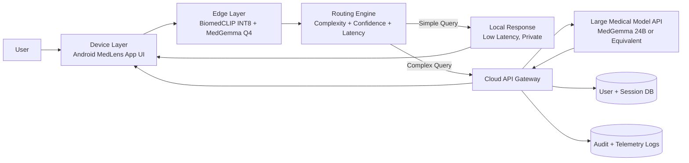
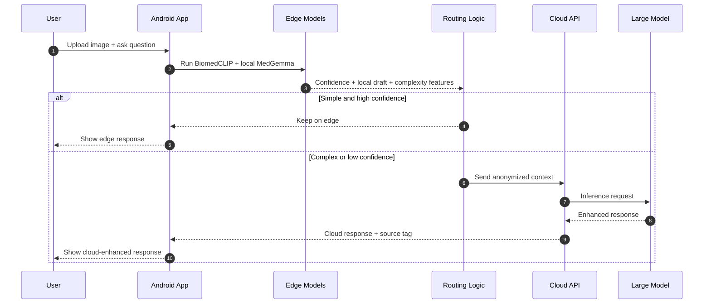
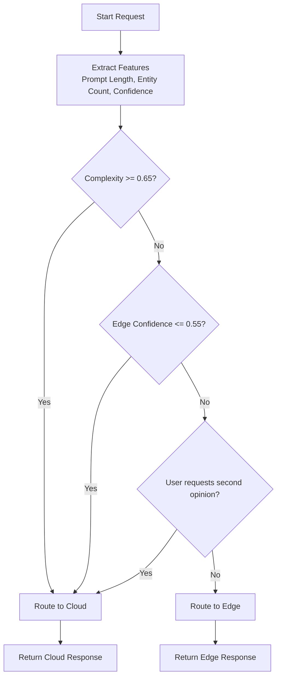
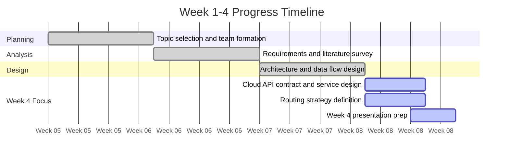
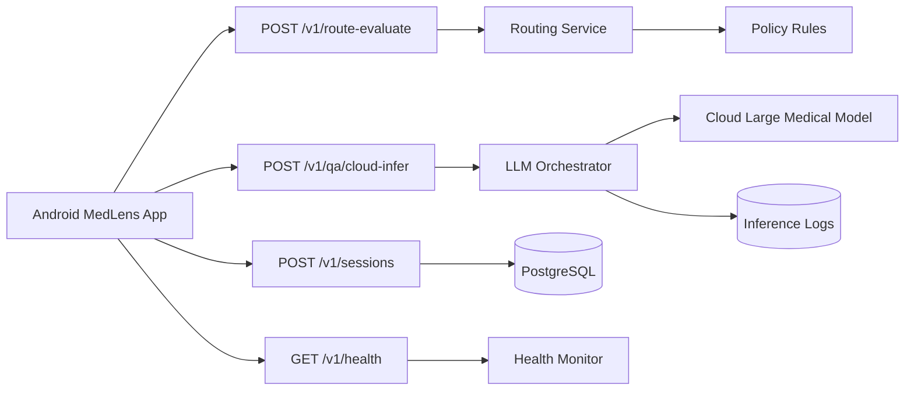

# MedLens Week 1-4 Visual Pack

Use these Mermaid diagrams directly in Markdown slides, GitHub, or Mermaid Live Editor.

## 1. Cloud-Edge-Device Architecture

## 2. End-to-End Interaction Flow

## 3. Routing Decision Diagram

## 4. Week 1-4 Milestone Timeline

## 5. Week 4 Cloud Services Map

## 6. Suggested Slide Mapping

- Slide 1: Architecture diagram
- Slide 2: End-to-end interaction sequence
- Slide 3: Routing decision logic
- Slide 4: Week 1-4 timeline
- Slide 5: Cloud services map
