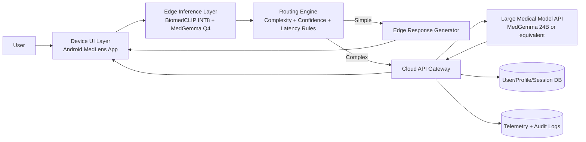

# Cloud-Edge-Device Collaborative Medical Q&A System
## Week 1 to Week 4 Progress Report (MedLens Extension)

## 1. Project Information

- Project name: MedLens Cloud-Edge Medical Assistant
- Course topic selection: Topic 4 (Edge-Assisted Intelligent Q&A / Text Processing)
- Current base system: MedLens on-device Android app (BiomedCLIP INT8 + MedGemma Q4)
- Proposed extension for this course: Add cloud-side large model API support for complex queries, while preserving fast edge inference for simple queries.

## 2. Week 1: Topic Selection and Team Formation

### 2.1 Selected Topic

We selected Topic 4 because the current MedLens system already demonstrates high-quality edge AI deployment and quantization, which is a strong foundation for cloud-edge collaboration.

### 2.2 Core Scenario Requirements

The target scenario is medical assistive Q&A in low-resource settings. Core requirements are:

1. Fast and private local responses for common/simple clinical questions.
2. Higher-capability model access for complex reasoning, rare conditions, or long-context multi-turn queries.
3. Safe cloud-edge coordination with clear routing logic.
4. Explainable system behavior and measurable performance.

### 2.3 Team Formation

- Team members: [Add names and roles]
- Suggested role split:
  - Member A: Android/edge integration and routing logic
  - Member B: Cloud API and deployment
  - Member C: Evaluation, datasets, and report documentation

### 2.4 Initial Cloud-Edge-Device Responsibility Mapping

- Device layer: User interaction, image capture, local permissions, secure local storage.
- Edge layer (on phone): BiomedCLIP embedding + classifier + quantized MedGemma for fast local response.
- Cloud layer: Large model API orchestration, user profile storage, conversation logs (with consent), analytics, and model management.

## 3. Week 2: Requirements Analysis and Literature Survey

### 3.1 Functional Requirements

1. Accept multimodal input (image + text prompt).
2. Run local edge inference first when feasible.
3. Offload complex queries to cloud API.
4. Return response to app with clear source metadata (edge or cloud).
5. Maintain clinical safety disclaimers and non-diagnostic framing.

### 3.2 Non-Functional Requirements

1. Latency targets:
   - Edge simple query first-token latency: less than 8 seconds.
   - Cloud offloaded query response latency (with network): less than 15 seconds target.
2. Reliability: graceful fallback when cloud is unavailable.
3. Privacy: minimize PHI transfer, support anonymization before cloud offload.
4. Cost control: route only necessary requests to cloud models.

### 3.3 Literature and Related Systems to Reference

1. Edge-cloud DNN partitioning work (for routing intuition):
   - Teerapittayanon et al., BranchyNet (early exit concept)
   - Kang et al., Neurosurgeon (cloud-edge partitioning)
   - Li et al., Edgent (latency-aware co-inference)
2. Medical multimodal models:
   - MedGemma model family documentation
   - BiomedCLIP model card and biomedical VLM usage literature
3. Edge optimization references:
   - ONNX Runtime quantization guidance
   - llama.cpp quantization and mobile inference practices

### 3.4 Key Technical Challenges Identified

1. Routing threshold design (what counts as simple vs complex query).
2. Cloud API reliability under unstable network.
3. Android-side request queueing and timeout handling.
4. Privacy risk when sending user data or image context to cloud.
5. Cost/performance trade-off of cloud large model calls.

## 4. Week 3: System Architecture Design Review

### 4.1 Proposed Architecture (Cloud-Edge-Device)

### 4.2 Data Flow and Interaction Pattern

1. User captures image and asks question in app.
2. Edge stack computes image embedding and local model draft response.
3. Routing engine evaluates complexity score and confidence score.
4. If simple and confidence is high, edge answer is returned.
5. If complex or low confidence, anonymized context is sent to cloud API.
6. Cloud large model generates enhanced response and returns to app.
7. App displays response with source tag: Edge or Cloud.

### 4.3 Initial Routing Strategy Design

A practical first version:

- Compute complexity score from:
  - Prompt length
  - Number of medical entities
  - Multi-condition ambiguity indicators
  - Edge classifier confidence
- Route to cloud when:
  - Complexity score is above threshold T, or
  - Edge confidence is below threshold C, or
  - User explicitly requests second opinion.

Rule example:

- Route to cloud if (complexity >= 0.65) OR (confidence <= 0.55)
- Otherwise keep on edge.

### 4.4 Technology Choices and Justification

- Edge app: Kotlin + Android Jetpack Compose (already implemented)
- Edge model runtime:
  - ONNX Runtime (BiomedCLIP INT8)
  - llama.cpp JNI bridge (MedGemma GGUF)
- Cloud API:
  - FastAPI (Python) for rapid integration and clean REST design
  - Optional async task queue for long requests
- Database:
  - PostgreSQL for user/session metadata
  - Redis optional for caching and short-lived session state
- Deployment:
  - Docker containerized cloud services

Why this stack is reasonable:

1. Reuses validated MedLens edge pipeline.
2. FastAPI is lightweight and well-suited for model-serving gateways.
3. PostgreSQL provides reliable structured data handling.
4. Containerized deployment supports reproducibility for course demo.

## 5. Week 4: Cloud Platform Development Progress

## 5.1 Current State from Existing Repository

The current MedLens repository strongly covers edge deployment and optimization:

1. Quantized on-device inference pipeline is working.
2. Evaluation scripts and benchmark documents exist.
3. Android app architecture is production-oriented for edge workflows.

Gap relative to Topic 4 course requirement:

- Cloud API offload path is not yet implemented in code.

## 5.2 Cloud Services Planned and Under Development

For Week 4 milestone alignment, the following cloud services are defined:

1. API Service Layer
   - POST /v1/route-evaluate
   - POST /v1/qa/cloud-infer
   - POST /v1/sessions
   - GET /v1/health

2. Data Storage Layer
   - user table (basic profile and settings)
   - session table (request metadata)
   - inference_log table (latency, route decision, model source)

3. Business Logic Layer
   - Rule-based routing policy service
   - PHI masking/anonymization utility
   - Response formatting and safety wrapper

## 5.3 Week 4 Demonstrable Deliverables

By Week 4 progress presentation, we should show:

1. Architecture diagram and interface contracts finalized.
2. API schema and request/response examples finalized.
3. Cloud service skeleton running (health endpoint + one inference endpoint mock).
4. Android integration plan for calling cloud API when route decision is cloud.

## 5.4 Technical Difficulties Encountered / Expected

1. Selecting cloud model provider and API cost constraints.
2. Handling mobile network instability and retries.
3. Ensuring privacy-safe payload transformation before upload.
4. Keeping response format consistent between edge and cloud outputs.

## 6. Requirement Coverage Check (Week 1 to Week 4)

1. Topic selected and scoped: completed.
2. Scenario requirements and cloud-edge-device mapping: completed.
3. Architecture and data flow draft: completed.
4. Technology stack selection and justification: completed.
5. Cloud-side implementation progress:
   - Design complete
   - API contract complete
   - Initial service implementation in progress

## 7. Next Steps (Week 5 to Week 7 Preview)

1. Implement working FastAPI cloud endpoints with database integration.
2. Integrate Android routing client (edge-first, cloud fallback).
3. Add end-to-end demo: app -> router -> cloud model -> app.
4. Collect Phase 1 metrics for cloud API response time and reliability.
5. Prepare architecture report and reproducible deployment guide.

## 8. Suggested 5-8 Minute Presentation Flow

1. Problem and motivation (1 min)
2. Current MedLens capabilities (1 min)
3. Cloud-edge-device architecture and data flow (2 min)
4. Routing strategy and stack choices (1.5 min)
5. Week 4 cloud progress and blockers (1 min)
6. Week 5 plan and expected demo scope (0.5 min)

## 9. Conclusion

Using MedLens as a strong edge base is a highly feasible strategy for Topic 4. The key requirement to satisfy the course rubric is the cloud extension: implement and demonstrate a real cloud offloading path with a clear routing policy. This keeps your existing strengths and directly aligns with the cloud-edge collaboration goals of the project.
