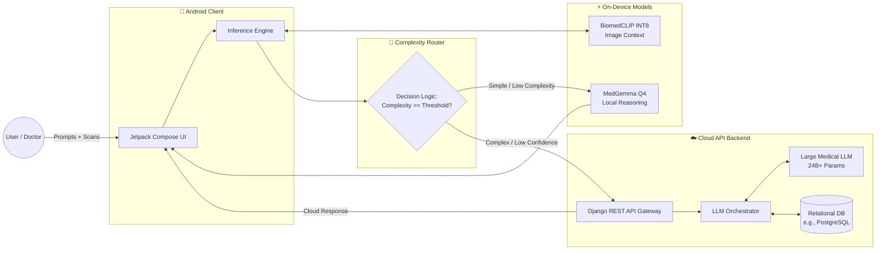
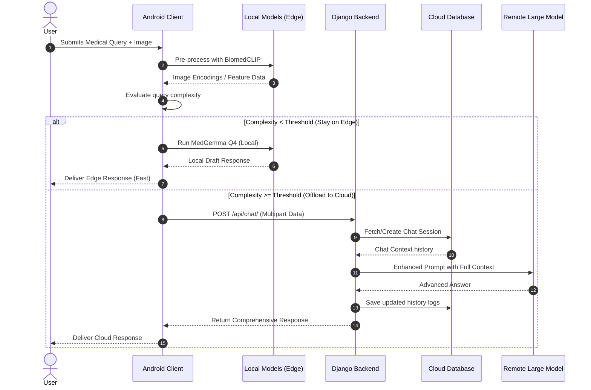
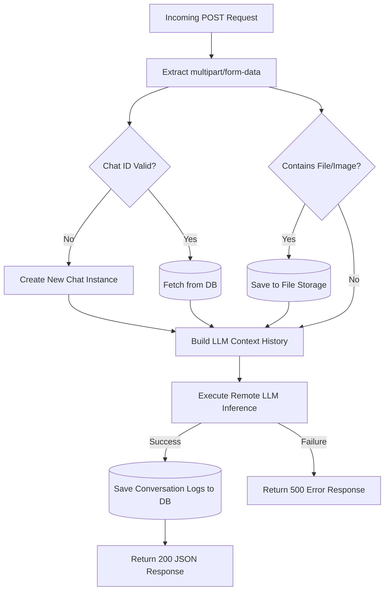
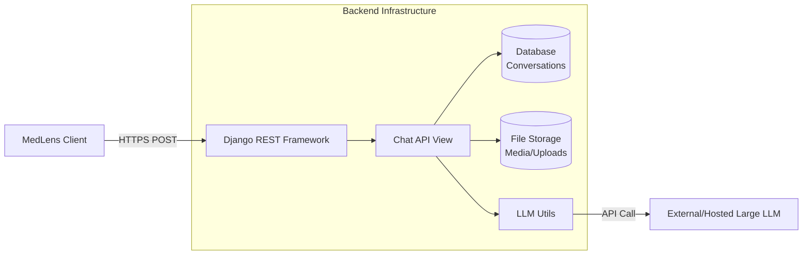

# MedLens Cloud-Edge Hybrid Architecture 

This document contains the complete architectural visuals for the MedLens Cloud-Edge integration project. These Mermaid diagrams can be previewed directly in GitHub, Markdown editors, or the Mermaid Live Editor.

## 1. Cloud-Edge-Device Architecture Layout

## 2. End-to-End Fallback Interaction Flow

## 3. Detailed Cloud Backend Data Flow

## 4. Cloud Services Resource Map

